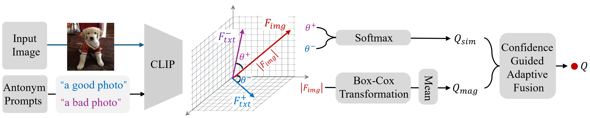

<div align="center">

<!-- <div class="logo">
    
</div> -->

<h1>Beyond Cosine Similarity: Magnitude-Aware CLIP for No-Reference Image Quality Assessment</h1>

<div>
    <a href='https://github.com/zhix000?tab=repositories' target='_blank'>Zhicheng Liao</a><sup>1</sup>&emsp;
    <a href='' target='_blank'>Dongxu Wu</a><sup>1</sup>&emsp;
    <a href='' target='_blank'>Zhenshan Shi</a><sup>1</sup>&emsp;
    <a href='https://scholar.google.com/citations?hl=zh-CN&user=pLHqgLIAAAAJ' target='_blank'>Sijie Mai</a><sup>1</sup>&emsp;
    <a href='https://dblp.org/pid/214/8898.html' target='_blank'>Hanwei Zhu</a><sup>2</sup>&emsp;
    <a href='https://github.com/lingyzhu0101' target='_blank'>Lingyu Zhu</a><sup>3</sup>&emsp;
    <a href='https://openreview.net/profile?id=~Yuncheng_Jiang1' target='_blank'>Yuncheng Jiang</a><sup>1</sup>&emsp;
    <a href='https://scholar.google.com/citations?hl=zh-CN&user=w_WL27oAAAAJ' target='_blank'>Baoliang Chen</a><sup>1*</sup>&emsp;
</div>
<div>
    <sup>1</sup>South China Normal University, China&emsp; 
    <sup>2</sup>Nanyang Technological University, Singapore&emsp; 
    <sup>3</sup>City University of Hong Kong, China&emsp; 
</div>
<div>
    <em>*denotes Corresponding author</em>
</div>

<div>
    <strong>Accepted to AAAI 2026</strong>
</div>

<div>
    <h4 align="center">
        • <a href="https://arxiv.org/pdf/2511.09948" target='_blank'>[arXiv]</a> • 
        <a href="https://maclip-github-io.vercel.app/" target='_blank'>[Project Page]</a> •
    </h4>
</div>



<strong>The proposed Magnitude-Aware CLIP(MA-CLIP) IQA provides training-free dual-source framework that integrates a statistically normalized magnitude score with semantic similarity via a confidence-guided fusion strategy.</strong>

<div>
    If you find MA-CLIP useful for your projects, please consider ⭐ this repo. Thank you! 😉
</div>


---

</div>

## :postbox: Updates
<!-- - 2023.12.04: Add an option to speed up the inference process by adjusting the number of denoising steps. -->
- 2026.1.20: Looking forward to meeting you in Singapore. Have fun! :yum:
- 2025.11.11: This repo is created.

## :diamonds: Installation

### Codes and Environment

```
# git clone this repository
git clone https://github.com/zhix000/Maclip.git
cd Maclip

# create new anaconda env
conda create -n maclip python=3.8 -y
conda activate maclip

# install python dependencies
pip install -r requirements.txt
```


## :circus_tent: Inference

### Usage:
1. **Configure Dataset Paths**  
   Modify the dataset paths in `inference_maclip.py`:
   - `image_paths_all`: List of root directories for each dataset.
   - `dataset_config`: Mapping from dataset names to their corresponding JSON annotation files (containing image paths and ground-truth quality scores).
   - Supported Datasets: `livec`, `AGIQA-3k`, `AGIQA-1k`, `SPAQ`, `CSIQ`, `TID2013`, `kadid`, `koniq`, `PIPAL`

2. **Run Inference**  
   Execute the inference script to evaluate image quality on specified datasets:
   ```
   python inference_maclip.py
   ```

## :zap: Quick Start
    
```bash
# Install with pip
pip install Maclip

# test with default settings
scorer = model.Maclip(backbone='RN50')  
pred = scorer(name, datasets, box_lam=0.5, base_cos=1.0, base_norm=0.6, alpha=1.0)
```
### Key Parameters
The model supports customizing evaluation behavior through parameters in `model.Maclip` and its `forward` method:
- `backbone`: CLIP backbone model (default: `RN50`, optional: `ViT-B/32`, `RN101` etc., from `clip_model.py`).
- `box_lam`: Lambda parameter for Box-Cox transformation (default: `0.5`)
- `base_cos`/`base_norm`: Base weights for fusion of cosine similarity and magnitude cues (default: `1.0`/`0.6`).
- `alpha`: Fusion coefficient (default: `1.0`)

## :love_you_gesture: Citation
If you find our work useful for your research, please consider citing the paper:
```
@misc{liao2025beyond,
  Author = {Liao, Zhicheng and Wu, Dongxu and Shi, Zhenshan and Mai, Sijie and Zhu, Hanwei and Zhu, Lingyu and Jiang, Yuncheng and Chen, Baoliang},
  Title  = {Beyond Cosine Similarity: Magnitude-Aware CLIP for No-Reference Image Quality Assessment},
  year      ={2025}, 
  eprint    ={2511.09948}, 
  archivePrefix={arXiv}, 
  primaryClass={cs.CV},
}
```

### Contact
If you have any questions, please feel free to reach out at `zcliao@m.scnu.edu.cn, blchen@m.scnu.edu.cn`. 